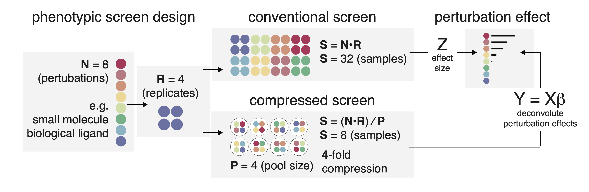

# Compressed screening

Code for the manuscript *Efficiently generating bio-chemical perturbation signatures in complex cellular systems by compressed screening*.

Key contributors
- Conner Kummerlowe, co-lead 
- Ben Mead, co-lead
- Ivy Liu, contributor (cNMF, deconvolution scripts)
- Thomas Cheng, contributor (cell painting analysis)
